# Data Structure

## Table of contents
- [Data Structure](#data-structure)
  - [Table of contents](#table-of-contents)
  - [參考資料:](#參考資料)
  - [Chapter00 何謂資料結構](#chapter00-何謂資料結構)
  - [Chapter01 Array 陣列](#chapter01-array-陣列)
    - [1-1 Array 陣列 (線性串列)](#1-1-array-陣列-線性串列)
    - [1-2 維度](#1-2-維度)
    - [1-3 多維陣列 (Multidimensional Arrays)](#1-3-多維陣列-multidimensional-arrays)
      - [1-3-1 One Dimensional Array](#1-3-1-one-dimensional-array)
      - [1-3-2 Two Dimensional Array](#1-3-2-two-dimensional-array)
      - [1-3-3 Three Dimensional Array](#1-3-3-three-dimensional-array)
  - [Chapter02](#chapter02)
    - [2-1 Linked List 連接串列](#2-1-linked-list-連接串列)
    - [2-2 Singly Linked List](#2-2-singly-linked-list)
    - [2-3 Double Linked List](#2-3-double-linked-list)
    - [2-4 Circular Linked List](#2-4-circular-linked-list)
  - [Chapter03 Stack](#chapter03-stack)
    - [3-1 堆疊](#3-1-堆疊)
    - [3-2 堆疊的ADP](#3-2-堆疊的adp)
  - [Chapter04 佇列 Queue](#chapter04-佇列-queue)
    - [4-1 佇列的APT](#4-1-佇列的apt)
  - [Chapter05 Tree](#chapter05-tree)
    - [5-1 樹](#5-1-樹)
    - [5-2 樹的定義](#5-2-樹的定義)
    - [5-3 結構](#5-3-結構)
    - [5-4 Binary Tree (二元樹)](#5-4-binary-tree-二元樹)
      - [5-4-1 完滿二元樹 (Fully Binary Tree)](#5-4-1-完滿二元樹-fully-binary-tree)
      - [5-4-2 完整二元樹 (Complete Binary Tree)](#5-4-2-完整二元樹-complete-binary-tree)
      - [5-4-3 歪斜樹 (Skewed Binary Tree)](#5-4-3-歪斜樹-skewed-binary-tree)
      - [5-4-4 二元樹的儲存方式](#5-4-4-二元樹的儲存方式)
    - [5-5 二元樹走訪 (Binary Tree Traversal)](#5-5-二元樹走訪-binary-tree-traversal)
  - [Chapter06 Graph 圖](#chapter06-graph-圖)
    - [6-1 定義](#6-1-定義)
    - [6-2 圖的種類](#6-2-圖的種類)
      - [6-2-1 相連](#6-2-1-相連)
    - [6-3 圖形表示法](#6-3-圖形表示法)
      - [6-3-1 Adjacency Matrix](#6-3-1-adjacency-matrix)
      - [6-3-2 Adjacency List](#6-3-2-adjacency-list)

---

## 參考資料: 
1. [擁抱「資料結構」的「演算法」](https://ithelp.ithome.com.tw/users/20129841/ironman/3300)
2. [【Python】Single Linked List(單向鏈結串列) 資料結構實作 | 愛喝咖啡 Ｘ 咖啡程式](https://lovedrinkcafe.com/python-single-linked-list/)
3. [CUM Linked List](https://www.andrew.cmu.edu/course/15-121/lectures/Linked%20Lists/linked%20lists.html)

---

## Chapter00 何謂資料結構

* 資料結構: 是以某一種方式`分類`、`排序`，並`儲存`於電腦裡。
* 關鍵要點:
  1. 存放位置
  2. 儲存方式
  3. 分類
  4. 排序

## Chapter01 Array 陣列

### 1-1 Array 陣列 (線性串列)

特性與限制:
1. 用來**儲存**一群**相同類型**的資料
2. 會使用一段**連續**的記憶體空間來存放
3. 必須**明確定義**要存放多少**數量**的資料
4. 可透過**Indexing**快速存取資料
5. 不易於`Add` or `Delete`資料

Example: 用藥盒裝一周的保健藥品:
1. 盒子用來裝保健藥品；不能裝感冒藥或其他藥品
2. 有一排的連續格子拿來裝保健藥品
3. 總共有7格(周一~周日)
4. 盒子上的標記(索引)，代表可以直接取走當天需要的藥品
5. 吃了一段時間後，想要變更順序，需要整體的大調整

```python
box = [
    "維他命D", "葉黃素", "蔓越莓錠", "B群", "綜合維他命", "益生菌", "維他命C"
]
# box[0] = "維他命D"
# box[2] = "蔓越莓錠"
```

### 1-2 維度

- 一維: 一條線
- 二維: 一個平面
- 三維: 一個立方體
- N維: 例如三維加上時間，等其他條件

### 1-3 多維陣列 (Multidimensional Arrays)

#### 1-3-1 One Dimensional Array

一維陣列，可以存放多個元素，類似串列`List`, `Array`
```python
import numpy
# One Dimensional Array
arr = numpy.array([1, 2, 3, 4, 5, 6, 7])
print(arr[2]) # 星期三
```

#### 1-3-2 Two Dimensional Array

二維陣列，除了星期幾以外，再新增**時段**，類似`Excel`的`table`
```python
import numpy
# Two Dimensional Array
arr = numpy.array([
    [1, 2, 3, 4, 5, 6, 7], # 早
    [1, 2, 3, 4, 5, 6, 7], # 中
    [1, 2, 3, 4, 5, 6, 7] # 晚
])
print(arr[1, 4]) # 週五的中午
```

#### 1-3-3 Three Dimensional Array
三維陣列，一個月(四周)；一個星期(七天)；每天(三個時段)

```python
import numpy
# Three Dimensional Array
arr = numpy.array([
    # 第一周
    [[1, 2, 3, 4, 5, 6, 7],
    [1, 2, 3, 4, 5, 6, 7],
    [1, 2, 3, 4, 5, 6, 7]],
    # 第二周
    [[1, 2, 3, 4, 5, 6, 7],
    [1, 2, 3, 4, 5, 6, 7],
    [1, 2, 3, 4, 5, 6, 7]],
    # 第三周
    [[1, 2, 3, 4, 5, 6, 7],
    [1, 2, 3, 4, 5, 6, 7],
    [1, 2, 3, 4, 5, 6, 7]],
    # 第四周
    [[1, 2, 3, 4, 5, 6, 7],
    [1, 2, 3, 4, 5, 6, 7],
    [1, 2, 3, 4, 5, 6, 7]]
])
print(arr[3, 1, 5]) # 第四周的星期四中午
```

## Chapter02 

### 2-1 Linked List 連接串列

Linked List有三種:
1. 單向
2. 雙向
3. 環狀

> 是一個有相似資料型態序列的nodes(節點)，
> 每一個node儲存一個data物件，與指向下一個node位址的pointer

特色:
- 節點資料的type、記憶體大小不用相同
- 不支援如stack的隨機存取(Random Access)
- 只能做循序純取(Sequential Access)
- 需要額外空間存放:
    1. head: 指向第一個node
    2. tail: 指向最後一個node
    3. 在依循搜尋時，current會指向當前的node

IT邦介紹:
1. 每個元素都是獨立的，與Array不同，不是一體成形
2. 可以單獨使用，也可以合併使用
3. 易於新增刪除、調整順序

※ 人脈弱連結:

A的朋友B，B的朋友C的表哥是明星D，所以A想要與明星D聯繫上，就必須:
```
A -> B -> C -> 明星D
```

### 2-2 Singly Linked List

單向連結串列

特性:
1. 不需要預留固定數量且一段連續的儲存空間
2. 一個節點包含**資料**與**指標**
3. 無索引，必須**單向**依序讀取**節點**，透過**指標**，才知道下一個要讀取哪個節點(無法像陣列透過索引就能讀取資料)
4. 插入或新增節點很方便，只要改變指標即可
5. 結尾是None(python) -> Null

### 2-3 Double Linked List

雙向連結串列

- 每個node都會有previous node and next node
- 新增時要改變4個pointer
- 刪除時要改變2個pointer (previous node.next and next node.previous)
- 結尾是 None(python) -> Null

### 2-4 Circular Linked List

環狀連結串列

- 將單向連結串列**最後一個節點**的指標，指向第一個節點

## Chapter03 Stack

### 3-1 堆疊

- 抽象資料型態 (Abstract Data Type, ADT): 大範圍，不具體、不仔細的資料
- 堆疊是一種抽象資料型態

特性:

1. 只能從最頂端存取資料
2. 只能從最頂端新增或刪除資料
3. 資料的存取必須符合後進先出 (Last In First Out, LIFO)

### 3-2 堆疊的ADP

只要某一個類有提供以下方法，我們都可以稱此類為一種堆疊

1. Create: 可以建立一個空堆疊
2. Push: 可以在頂端新增資料，並得到一個新堆疊
3. Pop: 可以刪除頂端資料，並得到一個新堆疊
4. Peek: 回傳堆疊頂端的資料

## Chapter04 佇列 Queue

特性:
1. 有兩個端點，分為**前後端**
2. 後端只能新增資料
3. 前端只能讀取、刪除資料
4. 資料存取必須符合先進先出(First In First Out, FIFO)

### 4-1 佇列的APT

1. Create: 建立一個新的佇列
2. Add: 可以在後端新增資料，並得到一個新的佇列
3. Delete: 可以在前端刪除資料，並得到一個新的佇列
4. Front: 回傳前端的資料

## Chapter05 Tree

### 5-1 樹

樹狀結構是一種**階層式的結構**，而非線性結構，資料沒有前後關係，
只有上下關係。

### 5-2 樹的定義
1. 是由一個或以上的`Node`所組成的集合
2. 有一個特定節點，稱為根節點(Root)，會在最頂層，與現實的樹是倒過來的關係
3. 除根節點外，其他的節點為互斥的集合，每個集合是樹根節點的子樹(Subtree)
4. 不會有迴路
5. 沒有次序(不同於二元樹的左右節點)

### 5-3 結構
|專有名詞|英文|解釋|
|---|---|---|
|根節點|Root|起源，結構的最頂層|
|父節點|Parent|除Root外，此節點若還有下層節點，則為Parent|
|子節點|Children|全部有上層節點的節點，則為Children|
|兄弟節點|Siblings|有共同的父節點|
|分支度|Degree|父節點下有幾個子節點|
|終端節點、樹葉節點|Terminal|沒有子節點，即最底層節點|
|非終端節點|Non-terminal|除樹葉節點外，都為非終端節點|
|階層|Level|位於樹狀結構的第幾層 (起始值: 1)|
|高度/深度|Heigh/Depth|樹狀結構總共有幾層|

### 5-4 Binary Tree (二元樹)

定義:
1. 二元樹可以是**空集合**
2. 每1個節點最多只有2個子節點，左與右節點
3. 有**次序**關係，左節點會排在右節點之前(不能顛倒)

#### 5-4-1 完滿二元樹 (Fully Binary Tree)

條件:
* 一個高度h，節點數量等於**2h-1**

```python
formula = 2 ** h - 1 # 2的h次方-1等於節點數量

# height = 3
ans = 2 ** 3 - 1 = 7
```

#### 5-4-2 完整二元樹 (Complete Binary Tree)

條件:
1. 高度h，節點數量少於**2h-1**
2. 由上到下，由**左至右**，都跟Fully Binary Tree一致

#### 5-4-3 歪斜樹 (Skewed Binary Tree)

條件:
1. 當所有的節點都只有左(右)節點時

#### 5-4-4 二元樹的儲存方式

* 陣列表示法

    使用陣列儲存**Fully Binary Tree**是最省空間的方式

計算節點位置:
- index = 0 -> 不引用
- index = 1 -> root
- 計算某節點的左節點: 2*i
- 計算某節點的右節點: 2*i + 1

### 5-5 二元樹走訪 (Binary Tree Traversal)

走訪定義: 讀取每個節點一次

走訪方式:

左子樹的順序一定會大於右，主要是根節點(root)的位置

範例: 6/2(1 + 2) = (6 / 2) * (1 + 2)

四則運算由左至右計算

1. 中序走訪 (Inorder):
   左子樹 -> root -> 右子樹
    ```
    example:
    (6 / 2) * (1 + 2)
    -> 6 / 2 = 3
    -> 3 * (1 + 2) = 9
    ```
2. 前序走訪 (Preorder):
   root -> 左子樹 -> 右子樹
    電腦運算，要符合2個數值&1個運算子的原則 (由右至左):
    ```
    example:
    * / 6 2 + 1 2
    -> + 1 2 = (1+2) = 3
    -> 6 2 3 = None
    -> / 6 2 = (6/2) = 3
    -> * 3 (3) = (3*3) = 9
    ```

3. 後序走訪 (Postorder):
   左子樹 -> 右子樹 -> root
   電腦運算，要符合2個數值&1個運算子的原則 (由左至左右):
    ```
    example:
    6 2 / 1 2 + *
    -> 6 / 2 = 3
    -> 3 1 2 = None
    -> 1 2 + = 3
    -> 3 3 * = 9
    ```

**快速辨別前中後序尋訪**

1. 中序: 頭尾皆為運算元
2. 前序: 最前面是運算子
3. 後序: 最後面是運算子

**中序換成前序**

```
4 + 5 * 6 - 3 + 1 / 2
-> 4 + (5 * 6) - 3 + (1 / 2)
-> (4 + (5 * 6)) - 3 + (1 / 2)
-> ((4 + (5 * 6)) - 3) + (1 / 2)
-> (((4 + (5 * 6)) - 3) + (1 / 2))
-> 運算子往前取代括號，每個符號取代對應組的左括號
-> +-+4*563/12
```
**中序換成後序**
```
4 + 5 * 6 - 3 + 1 / 2
-> 4 + (5 * 6) - 3 + (1 / 2)
-> (4 + (5 * 6)) - 3 + (1 / 2)
-> ((4 + (5 * 6)) - 3) + (1 / 2)
-> (((4 + (5 * 6)) - 3) + (1 / 2))
-> 運算子往前取代括號，每個符號取代對應組的右括號
-> 456*+3-12/+
```

**習題**
```
example: 93 100 * 10 14 * + 13 +
此為postorder (運算子在最右側)
-> 93 100 * = 9300
-> 9300 10 14 = None
-> 10 14 * = 140
-> 9300 140 + = 9440
-> 9440 13 + = 9453 #
```

## Chapter06 Graph 圖

### 6-1 定義
是由`頂點(Vertice)`和`邊(Edge)`所組成，
公式:
```
G = (V,E)
```
- G: 圖形 Graph
- V: 所有頂點(Vertice)的集合
- E: 所有邊(Edge)的集合

### 6-2 圖的種類

1. 無向圖(Undirected Graph)
   * 邊不具有方向性，例如:**雙向道**，
   * 邊以(A,B)表示
   * V: `{A,B,C,D,E}`
   * E: `{(A,B),(A,C),(B,C),(C,D),(C,E),(D,E)}`
    
    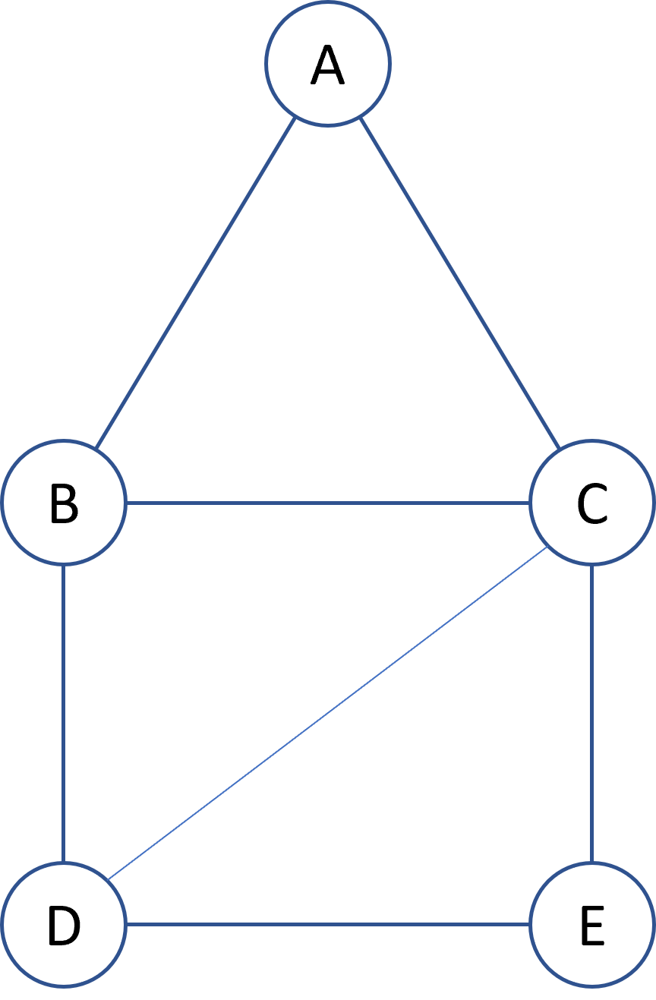

2. 有向圖(Directed Graph)
   * 邊具有方向性，例如:**單向道**，
   * 邊以<A,B>表示
   * V: `{A,B,C,D,E}`
   * E: `{<B,A>,<A,C>,<B,C>,<B,D>,<C,D>,<C,E>,<D,E>}`

    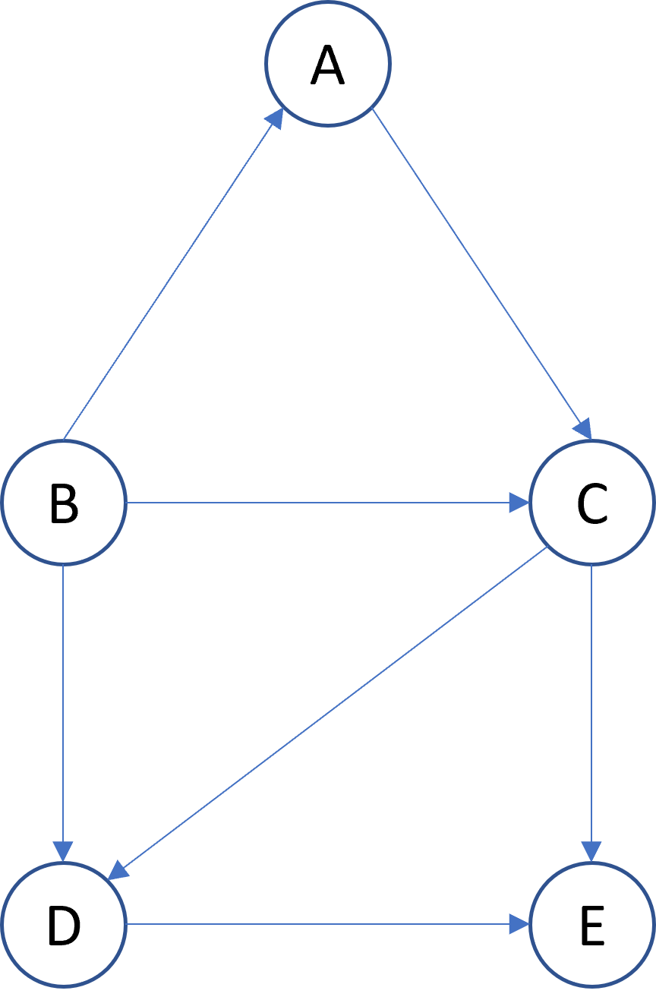

3. 完整圖形(Complete Graph)
   - In Undirected Graph, there 5 vertice and 10 edge, 符合公式: n (n - 1) / 2
   - In Directed Graph, there 5 vertice and 20 edge, 符合公式: n (n - 1)

    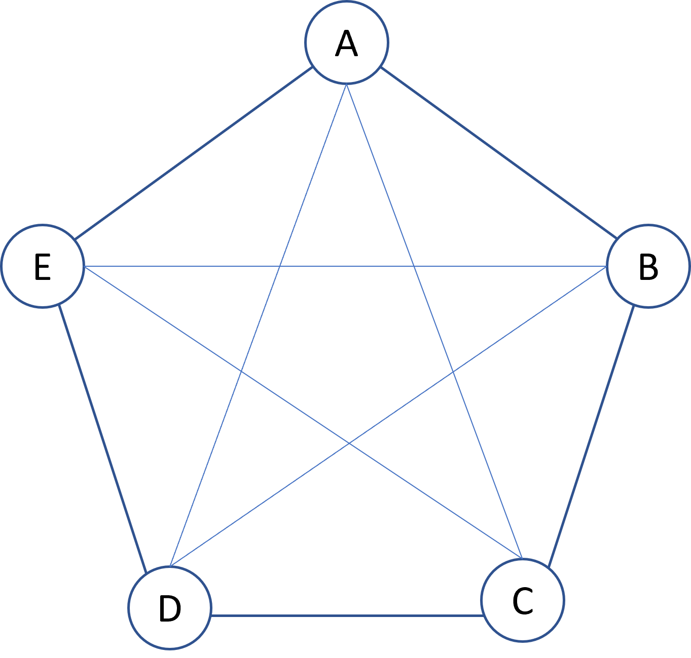

4. 子圖(Subgraph)
   * 假如`右圖`是`左圖`的子圖，則`乙圖`的vertice and edge，都會包含在`甲圖`中

    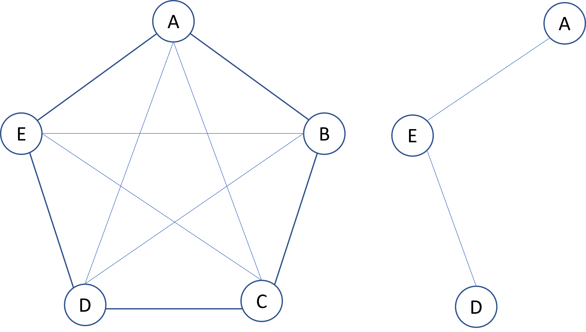

    |名詞|英文|解釋|範例|
    |---|---|---|---|
    |路徑|Path|兩個頂點所經過的邊，稱為路徑|如右圖的`A`到`D`，路徑: `{(A,E),(E,D)}`|
    |路徑長度|Path Length|路徑上總共包含幾條邊|如右圖`A`到`D`，總共經過2條邊(`{(A,E),(E,D)}`)|
    |簡單路徑|Simple Path|一條路徑，起點終點可以是同一個點，但其他頂點不能重複出現|如左圖，`ABCDEA`是簡單路徑；`ABCDBA`則不是|
    |循環|Cycle|起點與終點是同一個頂點的簡單路徑|如`ABCDEA`

#### 6-2-1 相連
> 相連: 兩個vertice之間，存有路徑可以相通

1. 相連單元 Connected Components
   
   在`無向圖`中，圖形有不同的元件(Components)，元件指的是上圖的兩個子圖，代表圖形是由多個子圖組成
   * 子圖之間互不相連
   * 子圖內部任一個`vertice`都存在`Path`可以通往任一端點

    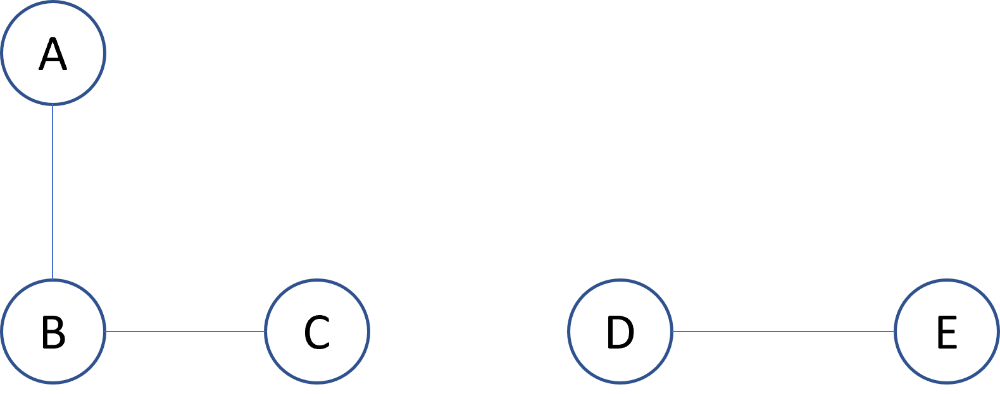

2. 強相連 Strongly Connected
   
    在`有向圖`中，任意兩端頂點之間存在路徑可以互通，如下圖，任一頂點都可以連到另一個頂點

    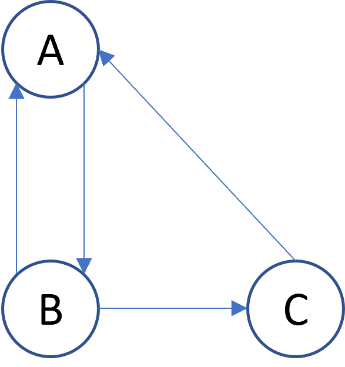

3. 強相連單元 Strongly Connected Compontents
   
   在`有向圖`中，任意兩點之間不存在路徑，下圖不是`強相連`，但為`強相連單元`


   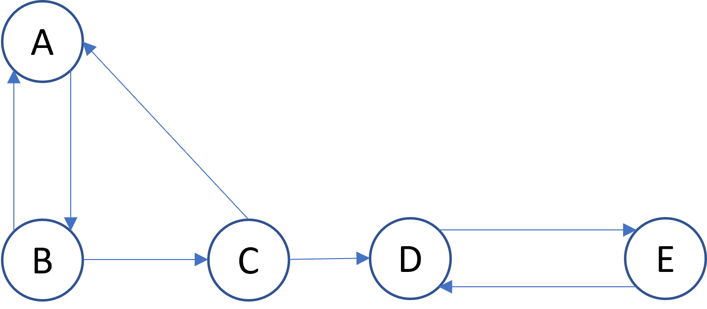

4. 分支度 Degree
   * 在`無向圖`中: 一個頂點包含幾條邊
   * 在`有向圖`中: 
     * 入分支度(In-Degree): 從其他端點指入此端點的個數，如下圖`A`的入分支度為1
     * 出分支度(Out-Degree): 從此端點指出的個數，如下圖`A`的出分支度為2

        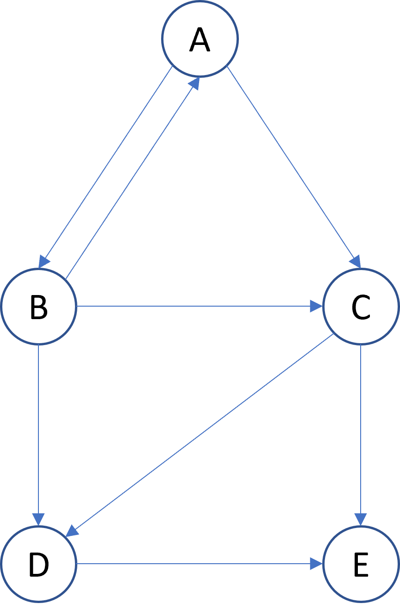

### 6-3 圖形表示法
共有4種:
1. 相鄰矩陣(Adjacency Matrix)
2. 相鄰串列(Adjacency List)
3. 相鄰多元串列(Adjacency Multilist)
4. 索引表(Index Table)

#### 6-3-1 Adjacency Matrix
定義: 一圖形，有n個頂點，則可使用`n * n`的二維陣列表示，範例下圖:
1. 為`4 * 4`的二維矩陣
2. `Value`為邊的數量

    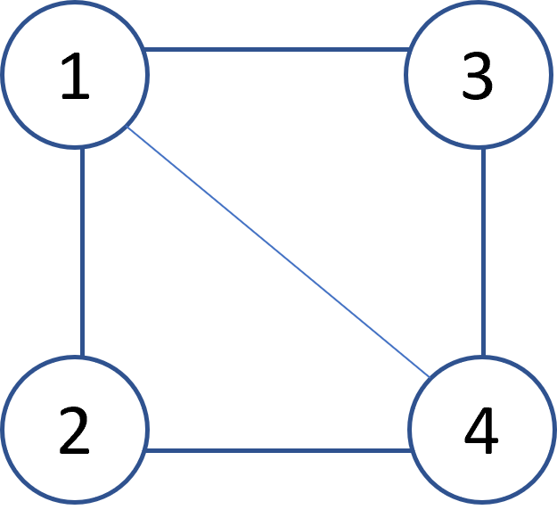
    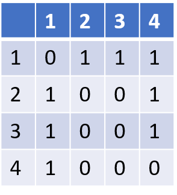

特性:
1. `無向圖`的矩陣是對稱的，對角線皆為`0`，`有向圖`則不一定
2. 對稱的情況下，只須保存一半的部分(沿對角線)，所以可以只需使用`n(n - 1 )/ 2`的空間

分支度:
* 有向圖: 頂點i的分支度，等於第i row的元素和。例如: 頂點1的分支和等於`row(1)`，`0 + 1 + 1 + 1 = 3`#
* 無向圖:
  * 出分支度: 第i row的元素和，如下圖: 頂點3的出分支度等於`1 + 1 = 2`
  * 入分支度: 第i column的元素和，如下圖: 頂點3的入分支度等於`1 + 0 + 0 = 1`

    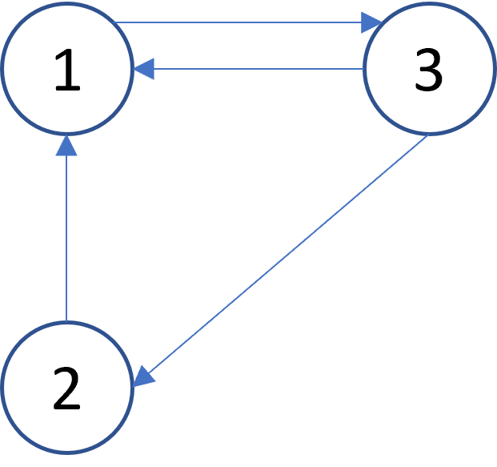
    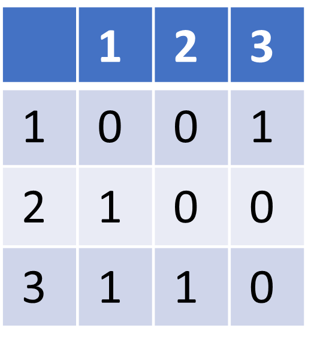

#### 6-3-2 Adjacency List
> 與Matrix不同的是，List只處理有Edge的部分。

定義: 每個頂點都有獨立的List，List的每個節點儲存相鄰的頂點，每個節點接包含: `頂點`與相鄰頂點的`指標`

