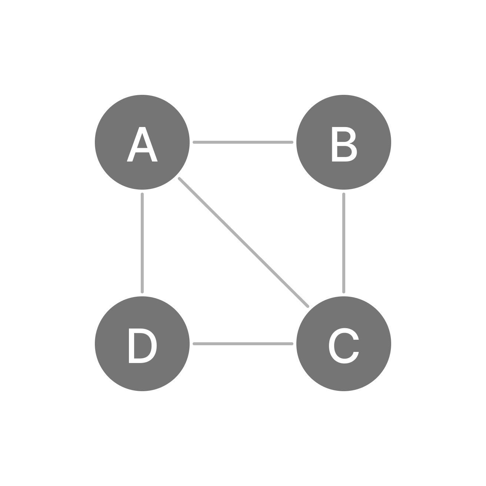
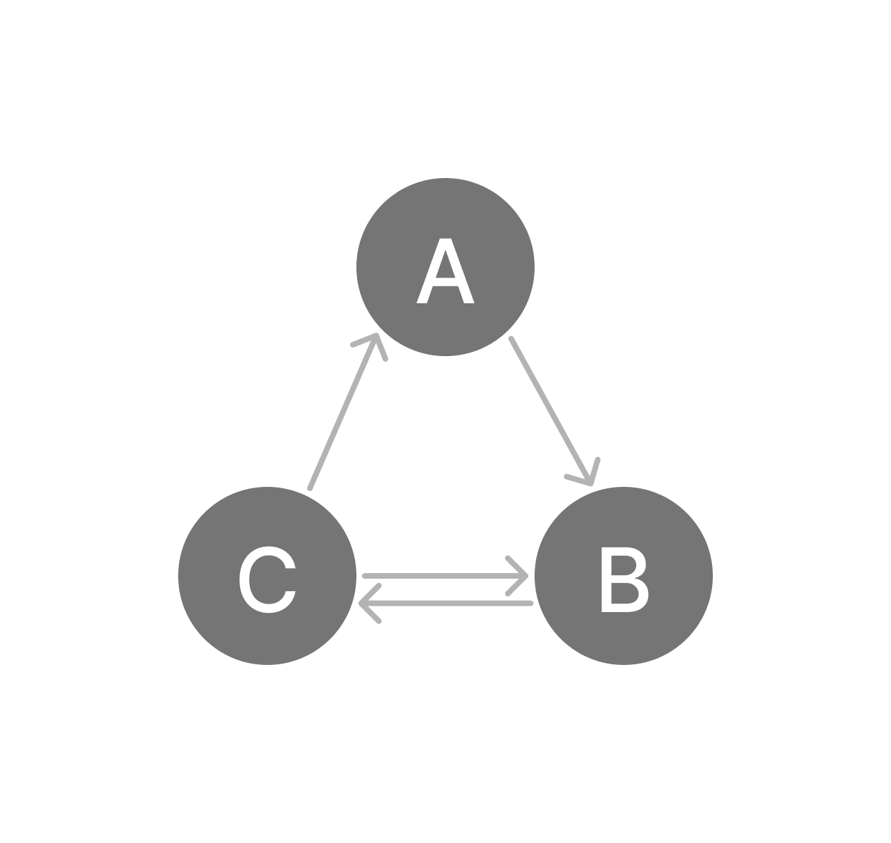

# Data Structure

Table of contents:

- [Data Structure](#data-structure)
  - [Chapter00 Intro](#chapter00-intro)
  - [Chapter01 Array 陣列](#chapter01-array-陣列)
    - [1-1 Dimension 維度](#1-1-dimension-維度)
      - [1-1-1 One Dimensional Array](#1-1-1-one-dimensional-array)
      - [1-1-2 Two Dimensional Array](#1-1-2-two-dimensional-array)
      - [1-1-3 Three Dimensional Array](#1-1-3-three-dimensional-array)
  - [Chapter02 Linked List 鏈結串列](#chapter02-linked-list-鏈結串列)
    - [2-1 Singly Linked List](#2-1-singly-linked-list)
    - [2-2 Double Linked List](#2-2-double-linked-list)
    - [2-3 Circular Linked List](#2-3-circular-linked-list)
  - [Chapter03 Stack](#chapter03-stack)
    - [3-2 堆疊的ADP](#3-2-堆疊的adp)
  - [Chapter04 佇列 Queue](#chapter04-佇列-queue)
    - [4-1 佇列的APT](#4-1-佇列的apt)
    - [4-2 Stack vs Queue](#4-2-stack-vs-queue)
  - [Chapter05 Tree](#chapter05-tree)
    - [5-1 Tree Definition](#5-1-tree-definition)
      - [5-1-1 Structure](#5-1-1-structure)
    - [5-2 Binary Tree 二元樹](#5-2-binary-tree-二元樹)
      - [5-2-1 Fully Binary Tree 完滿二元樹](#5-2-1-fully-binary-tree-完滿二元樹)
      - [5-2-2 Complete Binary Tree 完整二元樹](#5-2-2-complete-binary-tree-完整二元樹)
      - [5-2-3 Skewed Binary Tree 歪斜樹](#5-2-3-skewed-binary-tree-歪斜樹)
      - [5-2-4 二元樹的儲存方式](#5-2-4-二元樹的儲存方式)
    - [5-3 Binary Tree Traversal 二元樹走訪](#5-3-binary-tree-traversal-二元樹走訪)
      - [5-3-1 尋訪切換](#5-3-1-尋訪切換)
  - [Chapter06 Graph 圖](#chapter06-graph-圖)
    - [6-1 圖的表示方法](#6-1-圖的表示方法)
      - [6-1-1 Adjacency Matrix](#6-1-1-adjacency-matrix)
      - [6-1-2 Adjacency List](#6-1-2-adjacency-list)
      - [6-1-3 Adjacency Multi-list](#6-1-3-adjacency-multi-list)
      - [6-1-4 Index Table](#6-1-4-index-table)
    - [6-2 Connected Graph](#6-2-connected-graph)
  - [Chapter07 Hash](#chapter07-hash)
    - [7-1 Hashing Function](#7-1-hashing-function)
      - [7-1-4 Division Method](#7-1-4-division-method)
      - [7-1-5 Mid Square Method](#7-1-5-mid-square-method)
      - [7-1-6 Folding Method](#7-1-6-folding-method)
  - [Chapter08 集合與映射](#chapter08-集合與映射)
    - [8-1 Collection](#8-1-collection)
    - [8-2 HashSet](#8-2-hashset)
    - [8-3 Map / Dictionary](#8-3-map--dictionary)
  - [Chapter09 Algorithm](#chapter09-algorithm)
    - [9-1 效能分析](#9-1-效能分析)
    - [9-2 Big-O(O)](#9-2-big-oo)
      - [9-2-1 Big-O(1)](#9-2-1-big-o1)
      - [9-2-2 Big-O(n)](#9-2-2-big-on)
      - [9-2-3 Big-O(n^2)](#9-2-3-big-on2)
      - [9-2-4 Big-O(log n)](#9-2-4-big-olog-n)
      - [9-2-5 Big-O(n log n)](#9-2-5-big-on-log-n)
      - [9-2-6 Big-O(n!)](#9-2-6-big-on)
      - [9-2-7 總結](#9-2-7-總結)

---

Reference:

1. [擁抱「資料結構」的「演算法」](https://ithelp.ithome.com.tw/users/20129841/ironman/3300)
2. [【Python】Single Linked List(單向鏈結串列) 資料結構實作 | 愛喝咖啡 Ｘ 咖啡程式](https://lovedrinkcafe.com/python-single-linked-list/)
3. [CUM Linked List](https://www.andrew.cmu.edu/course/15-121/lectures/Linked%20Lists/linked%20lists.html)
4. [Tree Wiki](https://en.wikipedia.org/wiki/Tree_(data_structure))

## Chapter00 Intro

> 資料結構: 資料結構是一種資料組織與儲存格式，常被用於有效儲存存取資料。
> 以某一種方式`分類`、`排序`，並`儲存`於電腦裡。

- 關鍵要點:
  - 存放位置
  - 儲存方式
  - 分類
  - 排序

## Chapter01 Array 陣列

特性與限制:

1. 儲存相同類型的資料
2. 會使用一段**連續的**記憶體空間存放
3. 必須明確定義要存放的數量
4. 可透過Index索引資料
5. 不容易進行重新排序(因為記憶體空間是連續的，需要全部重新排列)

```C
// C
int main() {
  int arr[5] = {1, 2, 3, 4, 5};

  printf("%d\n", arr[0]);
  // 1
  printf("%d\n", arr[1]);
  // 2

  return 0;
}
```

※ 如C語言，當陣列空間不夠需要追加時，就需要設立另一個新變數(更長的array)，並將資料逐一存放到新變數中。

範例: [1-1.py](./Chapter01/1-1.py)

### 1-1 Dimension 維度

- One-Dimensional: Array
- Two-Dimensional: Matrix
- Three-Dimensional: 3D space
- n-Dimensional: 例如三維加上時間，等其他條件

Multidimensional Arrays 多維陣列: 可分為1、2、3、N維。

#### 1-1-1 One Dimensional Array

一維陣列: 可以存放多個元素，如`List`、`Array`

```C
// C
int main() {
  int arr[3] = {1, 2, 3};

  return 0;
}
```

```python
# Python
arr = [1, 2, 3]
```

#### 1-1-2 Two Dimensional Array

二維陣列: 包含`row` & `column`，如Excel的table、matrix

```C
// C
int main() {
  int arr[2][2] = {
    {1, 2},
    {3, 4}
  };

  return 0;
}
```

```python
# Python
arr = [[1, 2], [3, 4]]
```

#### 1-1-3 Three Dimensional Array

三維陣列: 一個月(四周)；一個星期(七天)；每天(三個時段)

```C
int main() {
  int arr[2][2][2] = {
    {
      {1, 2},
      {3, 4}
    },
    {
      {5, 6},
      {7, 8}
    }
  };

  return 0;
}
```

```python
arr = [
  [
    [1, 2],
    [3, 4]
  ],
  [
    [5, 6],
    [7, 8]
  ]
]
```

範例: [1-2.py](./Chapter01/1-2.py)

## Chapter02 Linked List 鏈結串列

Linked List共有四種形式:

- Singly linked list
- Doubly linked list
- Multiply linked list
- Circular linked list

> 是一個資料元素的線性集合，其在記憶體位置中的排序並不是連續給定。

### 2-1 Singly Linked List

特色:

- 不需預留連續的記憶體空間
- Node: data type and memory size都不需相同
  - 每個Node包含`Data` & `Pointer`
- 不需一體成形(如array)
- 不支援如stack的隨機存取(Random Access)
- 只能做循序存取(Sequential Access)
- 需要額外空間存放:
  - `head`: 指向第一個node
  - `tail`: 指向最後一個node
  - `current`: 在依循搜尋時，current會指向當前的node
- Add and insert方便

Example: 人脈弱連結

例如: A的朋友是B，B的朋友C的表哥是明星D，所以A想要與明星D聯繫上，就必須經過:

`A -> B -> C -> 明星D`

實作Singly Linked List: [2-1.py](./Chapter02/2-1.py)

### 2-2 Double Linked List

特色:

- 每個node都會有`previous node` & `next node`
- 新增時要改變4個pointer
  - 新增的node -> previous node & next node
  - 新增的node的前一個node -> 修改next node
  - 新增的node的下一個node -> 修改previous node
- 刪除時要改變2個pointer
  - previous node.next
  - next node.previous

### 2-3 Circular Linked List

> 將單向連結串列**最後一個節點**的指標，指向第一個節點

## Chapter03 Stack

- 抽象資料型態 (Abstract Data Type, ADT): 大範圍，不具體、不仔細的資料
- 堆疊是一種抽象資料型態(ADT)

特性:

- 只能從最**頂端**(tail)存取資料
- 只能從最**頂端**(tail)新增或刪除資料
- 資料的存取必須符合**後進先出** (Last In First Out, **LIFO**)

### 3-2 堆疊的ADP

堆疊(Stack)的class條件:

- Create: 可以建立一個空堆疊
- Push: 可以在頂端新增資料，並得到一個新堆疊
- Pop: 可以刪除頂端資料，並得到一個新堆疊
- Peek: 回傳堆疊頂端的資料

## Chapter04 佇列 Queue

特性:

- 有兩個端點，分為**前後端**
- 後端只能新增資料
- 前端只能讀取、刪除資料
- 資料存取必須符合**先進先出**(First In First Out, **FIFO**)

### 4-1 佇列的APT

佇列(Queue)的class條件:

- Create: 建立一個新的佇列
- Add: 可以在後端新增資料，並得到一個新的佇列
- Delete: 可以在前端刪除資料，並得到一個新的佇列
- Front: 回傳前端的資料

### 4-2 Stack vs Queue

| Type  | Feature | Add  | Delete | Read |
| :---: | :-----: | :--: | :----: | :--: |
| Stack | LIFO    | 頂端 | 頂端    | 頂端 |
| Queue | FIFO    | 後端 | 前端    | 前端 |

※ 以Array來看，Stack的頂端即為後端(尾端)

## Chapter05 Tree

### 5-1 Tree Definition

> 樹狀結構是一種**階層式的結構**，而非線性結構，資料沒有前後關係，只有上下關係。

Definition:

1. 由1個(或以上)的`Node`所組成的集合
2. 有一個特定節點，稱為根節點(**Root**)，會在最頂層，與現實的樹是上下顛倒的關係
3. 除了Root以外，其他的Node皆為互斥的集合，每個集合是樹根節點的子樹(Subtree)
4. 不會形成迴路
5. 沒有Sequence(不同於二元樹的左右節點)

#### 5-1-1 Structure

| 專有名詞  |  英文  |       解釋       |
| :-----:  | :----: | :--------------: |
| 根節點   | Root   | 結構的最頂層      |
| 父節點   | Parent | 除Root外，此節點若還有下層節點，則為Parent|
| 子節點   | Children| 全部有上層節點的節點，則為Children|
| 兄弟節點 | Siblings| 有共同的父節點   |
| 分支度   | Degree  | 父節點下有幾個子節點|
| 終端節點、樹葉節點| Terminal| 沒有子節點，即最底層節點|
| 非終端節點| Non-terminal| 除樹葉節點外，都為非終端節點|
| 階層      | Level | 位於樹狀結構的第幾層 (起始值: 1)|
| 高度/深度 | Heigh/Depth| 樹狀結構總共有幾層|

### 5-2 Binary Tree 二元樹

定義:

1. 二元樹可以是**空集合**
2. 每個Node最多只有2個Children，左與右節點
3. 有**次序**關係，左節點會排在右節點之前(`left -> right`)

#### 5-2-1 Fully Binary Tree 完滿二元樹

條件: 一個高度`h`，節點數量等於`2h-1`

```python
# 2的h次方-1等於節點數量
formula = 2 ** h - 1

# If the height is 3
ans = 2 ** 3 - 1 = 7
```

#### 5-2-2 Complete Binary Tree 完整二元樹

條件:

- 高度`h`，節點數量少於`2h-1`
- 由上到下，由**左至右**，都跟`Fully Binary Tree`一致

#### 5-2-3 Skewed Binary Tree 歪斜樹

條件: 當所有的節點都只有**左(右)節點**時

#### 5-2-4 二元樹的儲存方式

陣列表示法: 使用陣列儲存**Fully Binary Tree**是最省空間的方式

計算節點位置:

- `index = 0` -> 不引用
- `index = 1` -> root
- 計算某節點的左節點: `2 * i`
- 計算某節點的右節點: `2 * i + 1`

### 5-3 Binary Tree Traversal 二元樹走訪

走訪定義: 每個**Node**都讀取一次

> 記憶方式: Root所在的位置就是XX走訪，而三者之間，左子樹一定會在右子樹左側。

Example: In-Order traversal

Explanation: 中序尋訪，因此Root會在中間位置，而最左邊會是左子樹；最右邊為右子樹，因此答案為 => `左子樹 -> Root -> 右子樹`

走訪方式:

範例: `6 / 2 * (1 + 2) = (6 / 2) * (1 + 2)`

四則運算由左至右計算

- 中序走訪 (In-order Traversal): 左子樹 -> Root -> 右子樹

    ```python
    # Example
    (6 / 2) * (1 + 2)
    -> 6 / 2 = 3
    -> 3 * (1 + 2) = 9
    ```

- 前序走訪 (Pre-order Traversal): Root -> 左子樹 -> 右子樹
  
  ※ 電腦運算要符合2個數值 & 1個運算子的原則 (由右至左):

    ```python
    # Example
    * / 6 2 + 1 2
    -> + 1 2 = (1+2) = 3
    -> 6 2 3 = None
    -> / 6 2 = (6/2) = 3
    -> * 3 (3) = (3*3) = 9
    ```

- 後序走訪 (Post-order Traversal): 左子樹 -> 右子樹 -> Root

  ※ 電腦運算要符合2個數值 & 1個運算子的原則 (由左至左右):

    ```python
    # Example
    6 2 / 1 2 + *
    -> 6 / 2 = 3
    -> 3 1 2 = None
    -> 1 2 + = 3
    -> 3 3 * = 9
    ```

快速辨別前中後序尋訪:

1. In-Order: 頭尾皆為運算元
2. Pre-Order: 最前面是運算子
3. Post-Order: 最後面是運算子

#### 5-3-1 尋訪切換

中序換成前序

```python
4 + 5 * 6 - 3 + 1 / 2
-> 4 + (5 * 6) - 3 + (1 / 2)
-> (4 + (5 * 6)) - 3 + (1 / 2)
-> ((4 + (5 * 6)) - 3) + (1 / 2)
-> (((4 + (5 * 6)) - 3) + (1 / 2))
-> 運算子往前取代括號，每個符號取代對應組的左括號
-> +-+4*563/12
```

中序換成後序

```python
4 + 5 * 6 - 3 + 1 / 2
-> 4 + (5 * 6) - 3 + (1 / 2)
-> (4 + (5 * 6)) - 3 + (1 / 2)
-> ((4 + (5 * 6)) - 3) + (1 / 2)
-> (((4 + (5 * 6)) - 3) + (1 / 2))
-> 運算子往前取代括號，每個符號取代對應組的右括號
-> 456*+3-12/+
```

習題:

```python
# Example: 93 100 * 10 14 * + 13 +
# 此為Post-order (運算子在最右側)
-> 93 100 * = 9300
-> 9300 10 14 = None
-> 10 14 * = 140
-> 9300 140 + = 9440
-> 9440 13 + = 9453 #
```

## Chapter06 Graph 圖

Reference: [【資料結構】圖論（Graph）Part 1](https://yalanin.medium.com/%E8%B3%87%E6%96%99%E7%B5%90%E6%A7%8B-%E5%9C%96%E8%AB%96-graph-part-1-41d7875cb684)

定義: 通常由2個集合，包含`頂點(Vertices)`和`邊(Edges)`所組成，公式:

```python
# Graph -> G
# Vertices -> V (所有頂點的集合)
# Edges -> E (所有邊的集合)
G = (V, E)
```

Graph的類型有2種:

- Undirected Graph (Simply Graph)
  - 最大邊線數: `n * (n - 1) / 2`
  - Example: `4 * (4 - 1) / 2 = 6` (四邊形加上中間交叉2條線)
- Directed Graph (Diagraph)
  - 最大邊線數: `n * (n - 1)` (無向圖的2倍，因為每個邊都可以雙向各一條)

限制:

1. 起點與終點不為同一頂點
2. 對於相同的兩頂點，邊不能出現多次

### 6-1 圖的表示方法

共有4種:

- Adjacency Matrix 相鄰矩陣
- Adjacency List 相鄰串列
- Adjacency Multi-list 相鄰多元串列
- Index Table 索引表

#### 6-1-1 Adjacency Matrix

定義: 一個Graph有n個vertices，則可透過`n * n`的two-dimension array表示。

Undirected Graph:



Explanation: 自己(相同vertices)或不相鄰的點都為`0`，下表為two-dimensional matrix

|  | A | B | C | D |
|--|:-:|:-:|:-:|:-:|
|A | 0 | 1 | 1 | 1 |
|B | 1 | 0 | 1 | 0 |
|C | 1 | 1 | 0 | 1 |
|D | 1 | 0 | 1 | 0 |

特性:

- Undirected graph的matrix是對稱的，directed graph則不一定。
- 因為undirected graph的matrix是對稱的，所以只要保留上/下三角即可，且僅需要`n * (n - 1) / 2`的空間

分支度:

- Undirected graph: 將同一列(row)的數值加總即為分支度
- Directed graph:
  - 出分支度: 任一頂點的row數值加總就是該頂點的出分支度。如下圖，`C`頂點的出分支度即為2。
  - 入分支度: 任一頂點的column數值加總就是該頂點的入分支度。如下圖，`B`頂點的入分支度即為2。

Directed Graph:



Adjacency Matrix:

|  | A | B | C |
|--|:-:|:-:|:-:|
|A | 0 | 1 | 0 |
|B | 0 | 0 | 1 |
|C | 1 | 1 | 0 |

#### 6-1-2 Adjacency List

> 與Adjacency Matrix不同的是，Adjacency List只處理有Edge的部分。

定義: 每個頂點都有獨立的List，List的每個Node儲存相鄰的Vertices，每個Node皆包含: `Vertices` & `Pointer`


Adjacency List (`->`代表pointer):

- `A` -> `B` -> `C` -> `D`
- `B` -> `A` -> `C`
- `C` -> `A` -> `B` -> `D`
- `D` -> `A` -> `C`

特性:

- 無向圖: 有`n`個頂點，以及`e`個邊
  - 首節點數: `n`
  - 節點數: `2 * e` (排除首節點數後，將所有節點數相加)
  - Example: 如上圖，`n = 4`，`e = 5`，則會有4個頂點及10個節點。
- 有向圖: 有`n`個頂點，以及`e`個邊
  - 首節點數: n
  - 節點數: e (排除首節點數後，將所有節點數相加)
- Example: 如下圖，`n = 3`，`e = 4`，則會有3個頂點及4個節點。

Directed graph:


Adjacency List:

- `A` -> `B`
- `B` -> `C`
- `C` -> `A` -> `B`

分支度:

- Undirected Graph:
  - 出分支度
    - 頂點的row數值相加，就是該頂點的分支度(排除首節點)
    - Example: 頂點`A`的分支度: 3
- Directed Graph:
  - 出分支度
    - 頂點的row數值相加，就是該頂點的分支度(排除首節點)
    - Example: 頂點`C`的出分支度: 2
  - 入分支度: 紀錄一組Inverse Adjacency List，來查詢計算入分支度
    - 以下列inverse adjacency list來看，頂點`B`的入分支度即為2

以上圖directed graph來紀錄Inverse Adjacency List:

- `A` <- `C`
- `B` <- `A` <- `C`
- `C` <- `B`

#### 6-1-3 Adjacency Multi-list

這個方式不同於Adjacency matrix and list，是以**Edge**為主。

定義: 每個`Edge`皆以一個`Node`表示

- 一個Node包含:
  - 邊的標記(代號)
  - 邊的起點
  - 邊的終點
  - Pointer1 (指向另一個有使用到**起點**的邊)
  - Pointer2 (指向另一個有使用到**終點**的邊)

Undirected graph:


Adjacency Multi-List:

Format: `LineName` `Start` `End` `Pointer1` `Pointer2`

- `L1` `A` `D` `L2_Start` `L4_End`
- `L2` `A` `B` `L5_Start` `L3_Start`
- `L3` `B` `C` `NULL` `L4_Start`
- `L4` `C` `D` `L5_End` `NULL`
- `L5` `A` `C` `NULL` `NULL`

步驟:

1. 先將每個邊的`Start` & `End`都列出
2. 針對每個邊的起與終點往下一條邊搜尋(也包含同一頂點的邊)，並將Pointer紀錄於1或2的位置
3. 如果沒有指向，則為`NULL`

#### 6-1-4 Index Table

Index Table: 使用2個one-dimensional array進行儲存，其中一組為Index序列

Undirected graph:


Index Table:

The vertices: `A`、`B`、`C`、`D`

| Index    | 1 | 2 | 3 | 4 | 5 | 6 | 7 | 8 | 9 |10 |
| :------: |:-:|:-:|:-:|:-:|:-:|:-:|:-:|:-:|:-:|:-:|
| Vertices | B | C | D | A | C | A | B | D | A | C |
| Group    | A | A | A | B | B | C | C | C | D | D |

※ Group row作為輔助參考

### 6-2 Connected Graph

Reference:

- [演算法 —連通元件(Connected Component)](https://ithelp.ithome.com.tw/articles/10333186)
- [Graph: Component 名詞解釋](https://medium.com/algorithm-solving/graph-component-%E5%90%8D%E8%A9%9E%E8%A7%A3%E9%87%8B-619aca6080a2)

> 相連: 兩個vertices之間，存有路徑可以相通

- Connected Graph: 一個connected graph即為一個Graph，每一個Node至少都有一條路徑可以到另一個Node。
- Connected Component: 一張undirected graph區分成幾個區塊且不連通時，每一個區塊都是一個connected component，孤立(獨立)點也是。
- Strongly Connected Component: In directed graph，任意兩節點之間，都存在可以互相到達的路徑。

## Chapter07 Hash

定義: Origin_Data => Hash Function => Hash Code (Value)

※ 且不可逆

※ `Hash Collision` 哈希衝突，兩個原始數值產生出相同的`Hash Code`

### 7-1 Hashing Function

Hash functions有2種types:

- Distribution - Independent function: hash function對於數據分布並不敏感。
  - Division method
  - Mid Square method (平方後取中間位數(字元))
  - Folding method
- Distribution - Dependent function: 反之。

#### 7-1-4 Division Method

Function: `H(k) = k (mod m)`

Example:

假設某公司有90個員工，而現在有100個位置可以儲存hash code (0-99)，並設定`m = 93`

試計算下列員工的hash address:

- H(2212) = 2212 % 93 = `73`
- H(1754) = 1754 % 93 = `80`
- H(1966) = 1966 % 93 = `13`

Hash Table:

| Hash Address | EmployeeID | EmployeeName |
| :----------: | :--------: | :----------: |
| 0            |            |              |
| 1            |            |              |
| 13           | 1966       | Andy         |
| ...          | ...        | ...          |
| 73           | 2212       | Dan          |
| ...          | ...        | ...          |
| 80           | 1754       | Ken          |

#### 7-1-5 Mid Square Method

TBC

#### 7-1-6 Folding Method

TBA

## Chapter08 集合與映射

### 8-1 Collection

各類集合的特性:

|類型|性質|說明|
|-|-|-|
|Sorted Set (有序集合)|排序性|會自動將資料由小至大排序|
|List|順序性|資料會按照某種順序排列|
|HashSet|重複性|HashSet不允許；但List允許重複|
|Key & Value|鍵值|每個集合中的元素都有自己的鍵值，具有唯一性|

### 8-2 HashSet

> 是一種實作集合(Collection)的類別

特性:

1. 無排序
2. 無順序
3. 資料不可重複，可包含空元素
4. 無鍵值

- HashSet在Python實作就是使用一般的`set.add`方式加入即可，[參考範例](Chapter08/8-1.py)
- 資料不可重複的特性[範例](Chapter08/8-2.py)

### 8-3 Map / Dictionary

映射/字典，Map提供鍵，讓我們可以快速找到值的內容，也就是常聽到的`鍵值對 (Key-value pairs)`，是Index & 內容的集合，常用`Map <K, V>`表示

特性:

1. 每個鍵值只能對應一個內容
2. 相同內容可以對應不同的鍵值
3. 可個別操作鍵值或內容
4. [程式碼操作](Chapter08/8-3.py)(Python中，等於基本的`dict`操作)

## Chapter09 Algorithm

> 合適的資料結構搭配快速有效的演算法，是工程師應培養的基礎能力

必要因素:

1. Input
2. 明確的指令
3. 有限的步驟
4. 有效的作法
5. Output

- 表示法
  - 文字
  - 虛擬碼 Pseudo Code
    - 演算法的描述語言，介於自然語言與程式語言之間，主要表達解決問題的`邏輯與架構`，可透過程式語言撰寫要執行的程式碼。
  - 流程圖 Flow Chart

### 9-1 效能分析

通常評估演算法的方式，主要考量以下兩個主要因素:

1. Time Complexity
   1. 時間複雜度是主要的考量因素
   2. 依照`實際執行時間`評估
   3. 又以以下三種符號來表示時間複雜度

      |符號|解釋|
      |-|-|
      |Big-O(O)|Worst Case，演算法時間函式的上限(Upper bound)，即最糟糕情況下的執行次數。|
      |Omega(Ω)|Best Case，演算法時間函式的下限(Lower bound)|
      |Theta(θ)|Average Case，演算法時間函式的上限與下限|

2. Space Complexity
   1. 執行演算法時，所使用的記憶體空間
   2. 記憶體空間與執行速度成反比
   3. 注意記憶體超過100%，可能會造成當機

### 9-2 Big-O(O)

#### 9-2-1 Big-O(1)

> 執行時間不受輸入資料量的影響

Example: [從陣列(List)取值](./Chapter09/9-1.py)

#### 9-2-2 Big-O(n)

> Input越多，Output也越多，執行時間成等比例增加

Example: [列印出陣列的每一個數值](./Chapter09/9-2.py)

#### 9-2-3 Big-O(n^2)

> Input數量增加，執行時間會以指數增加

Example: [巢狀迴圈](./Chapter09/9-3.py)

#### 9-2-4 Big-O(log n)

#### 9-2-5 Big-O(n log n)

#### 9-2-6 Big-O(n!)

#### 9-2-7 總結

執行時間由小至大排列:

|Time Complexity|說明|
|-|-|
|O(1)|常數時間|
|O(log n)|對數時間|
|O(n)|線性時間|
|O(n log n)|[線性乘對問題](https://youtu.be/JSceec-wEyw)|
|O(n^2)|平方時間|
|O(n!)|階乘時間|

陣列與連結串列比較表:

|動作|List|Linked List|
|-|-|-|
|讀取|`O(1)`: Index讀取|`O(n)`: 逐一讀取|
|新增|`O(n)`: 需要搬移其他項目|`O(1)`: 修改指標|
|刪除|`O(n)`: 需要搬移其他項目|`O(1)`: 修改指標|
